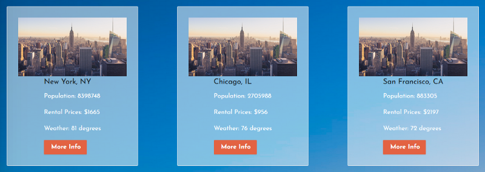
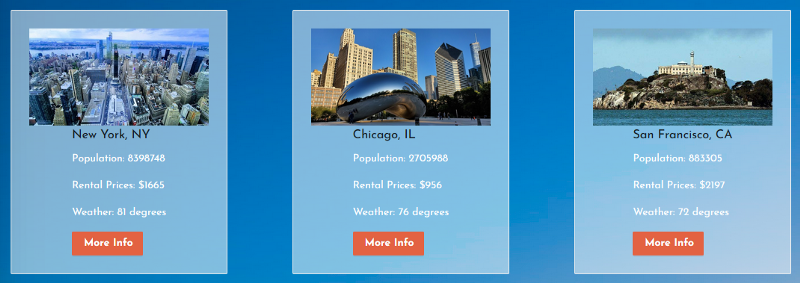

# Module Inquiry 8

## Writing Your Blog: Part 1

Your module inquiries this week will be prompting you toward composing different pieces of your sprint challenge blog post. As your responses to the questions/prompts below will be the first part of your blog post, please draft this in Medium or devto. **Your submission should be a link to your Medium or devto draft.**

# Adding City Images to Your React App
## Using the Google Places API to add live location-based images - the easy way
A few weeks ago, I entered the final phase of my training at Lambda School, a program called Lambda Labs. My team was given four weeks to build our version of Citrics - a city-comparison app centered on using different metrics to choose your ideal home city. This is the story of how I integrated Google Places to take our comparison view from this:

*Different cities, same placeholder on each*

to this:

*Unique city images sourced from Google Places*